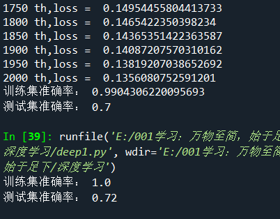

<!-- TOC -->

- [**手搓一个极简神经网络识别猫咪**](#手搓一个极简神经网络识别猫咪)
  - [**背景**](#背景)
  - [**原理**](#原理)
  - [**核心代码**](#核心代码)
  - [**效果**](#效果)
  - [**code**](#code)

<!-- /TOC -->
# **手搓一个极简神经网络识别猫咪**

## **背景**
1. 考研之前就可以选题了，本来想考研后再选，但是学校太push，怕没有题目了先占个坑，一不小心选了神经网络和医工融合的   
   考完研（目测已凉......)想退导师已经拉群了，只能硬着头皮上了。这几天看了一下神经网络，了解了点基础知识，找网上   
   的数据集照葫芦画瓢的写了一个只有一个神经元的网络（单细胞生物orz)，没有调用TensorFlow，PyTorch等框架，纯numpy   
   实现，主要是为了了解原理没有上框架（其实是不会框架目前......)

2. 训练集是209张64*64*3的含有动物的照片（.h5文件），测试集样本容量则是50
3. 环境：windows + anaconda下spyder，自然，使用Python语言


## **原理**
每一个像素作为一个特征点，一张照片的特征是特征点构成的特征向量X，对应一个权值向量W   
z = w*x + b    
sigmoid = 1/(1+e^(-z))   
loss使用交叉熵损失   
计算dw,db
w = w - r*dw   
b = b - r*db   
反复使用上述神经网络前馈+反馈公式直到达到收敛效果即可    

## **核心代码**
```python
def sigmoid(w,x,b):
    
    z = np.dot(x,w) + b
    a = 1/(1 + np.exp(-z))
    return a
    
def parameterInit() :
    w = np.zeros((12288,1))
    b = 0
    time = 20000
    r = 0.005
    return w,b,time,r
```
```python
while(t <= time):
        A = sigmoid(w,trainSetX,b) 
        loss = -np.sum(trainSetY*(np.log(A)) + (1-trainSetY)*(np.log(1-A))) / n  
        dz = A - trainSetY  
        dw = (np.dot(trainSetX.T,dz)) / n
        db = np.sum(dz) / n
        w = w - r*dw
        b = b - r*db
        if(t%100 == 0) :
            print(t,"th,loss = ",loss)
        t = t + 1

```

## **效果**
学习率为0.05与0.07下训练2000次的效果:   
   
只有一个神经元这样的效果也还行

## **code**
见文件deep1.py
